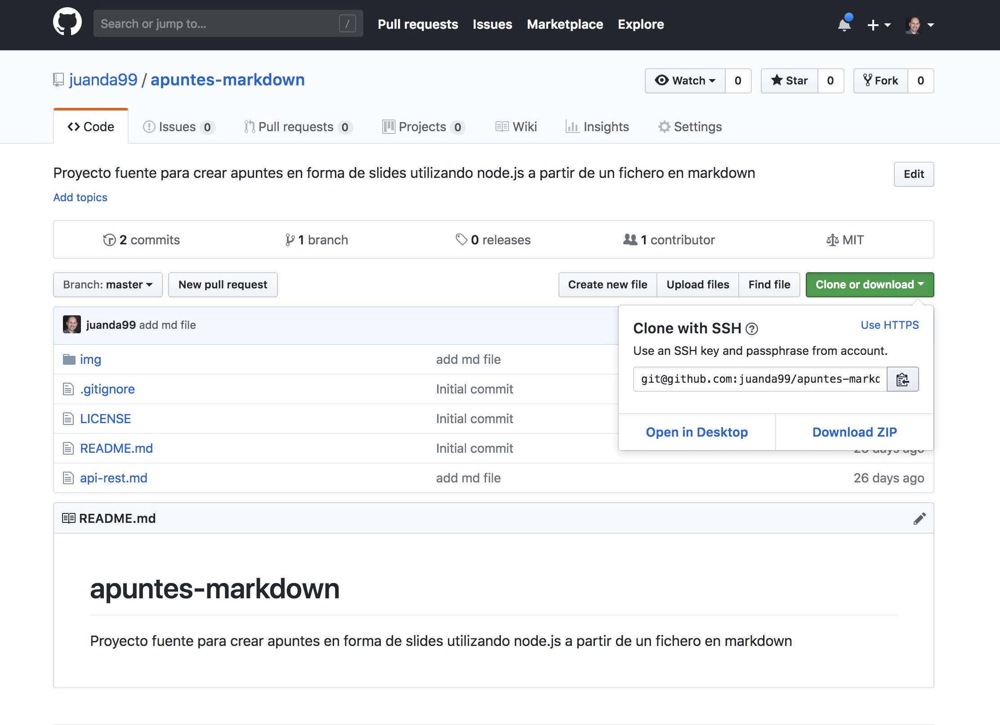

# Proyecto 2:  Apuntes en MarkDown

## Tiempo estimado: 45 minutos


## Descripción

- *Generación de slides y pdf a partir de markdown, útil para hacer apuntes*


## Objetivos

- Uso de un **módulos de terceros**
- Configuración de proyecto y gestión de paquetes mediante **npm**
- Uso de **npm scripts**


## Descargar ficheros

- [Descargar zip desde GitHub](https://github.com/juanda99/apuntes-markdown)




## Inicializar proyecto

- Utilizamos la herramienta npm init
  
  ```bash
  cd apuntes-markdown
  npm init
  ```

- Pulsamos al ENTER hasta el retorno del $PROMPT
- Observa estructura fichero *package.json* recién creado.


## Librerías candidatas

- [GitBook-cli](https://www.npmjs.com/package/gitbook-cli)
  - Ideal para libros: [curso webapps en 2016](https://legacy.gitbook.com/book/juanda/webapps/details)

- [reveal-md](https://www.npmjs.com/package/reveal-md)
  - Muy sencilla
  - La he usado para preparar estas diapositivas.

- También hay muchas opciones fuera de node, [ver ejemplo bash](https://github.com/asanzdiego/markdownslides)


## Instalar librerías

- Utilizaremos la [librería reveal-md](https://www.npmjs.com/package/reveal-md)
  ```
  npm install --save reveal-md
  ```
- O en su forma corta:
  ```
  npm i -S reveal-md
  ```
- Dependiendo de la versión de npm, -S no es necesario:
  ```
  npm i reveal-md
  ```
- Observa las modificaciones de *package.json*
- Utilizamos [semantic versioning](https://docs.npmjs.com/getting-started/semantic-versioning)


## Configurar scripts en package.json

- Antes:
```
  "scripts": {
    "test": "echo \"Error: no test specified\" && exit 1"
  },
```

- Después:
```
  "scripts": {
    "start": "reveal-md ./api-rest.md",
    "print": "reveal-md --theme white api-rest.md --print api-rest.pdf"
  },
```


## Ejecución de scripts

- Mediante el comando:

  ```bash
  npm run <script-name>
  ```

- Algunos se pueden "acortar":
  
  ```bash
  npm start
  npm run print
  ```

- reveal-md es un ejecutable que se ha instalado en *node_modules/.bin/reveal-md*
- Ese directorio está siempre en el PATH al ejecutar un script de un *package.json*


## Ejercicio

- Modifica el fichero *api-rest.md* o la configuración de *reveal-md* para que:
  - Se visualicen las diapositivas de una en una (sin cortes)


## Soluciones posibles

- Por defecto, las diapositivas se pueden separar así:

```bash
Override slide separator (default: \n---\n):
reveal-md slides.md --separator "^\n\n\n"

Override vertical/nested slide separator (default: \n----\n):
reveal-md slides.md --vertical-separator "^\n\n" 
```

- Otra opción es mediante un fichero *reveal-md.json*:
```js
{
  "separator": "^\n\n\n",
  "verticalSeparator": "^\n\n"
}
```


## Continuamos

- [Cómo crear una librería en Node.js](./3-proyecto-libreria.md)